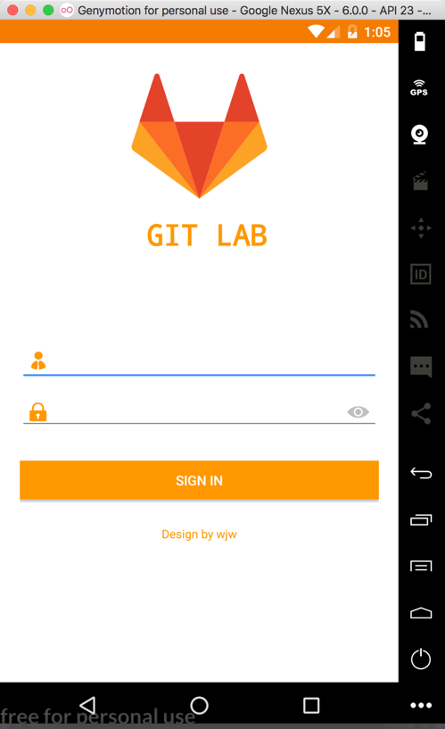
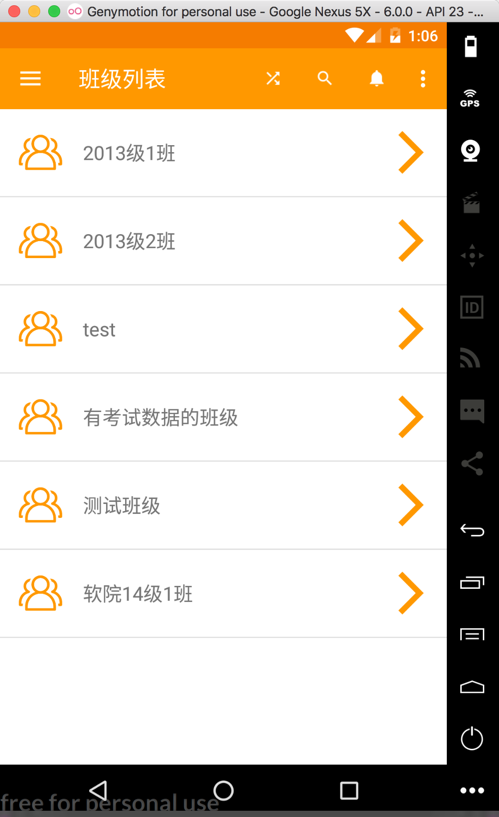
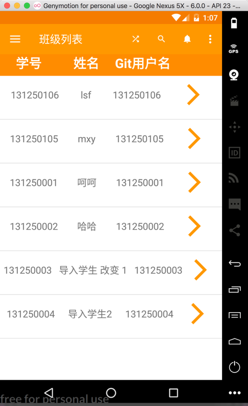
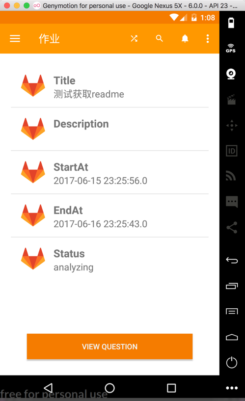
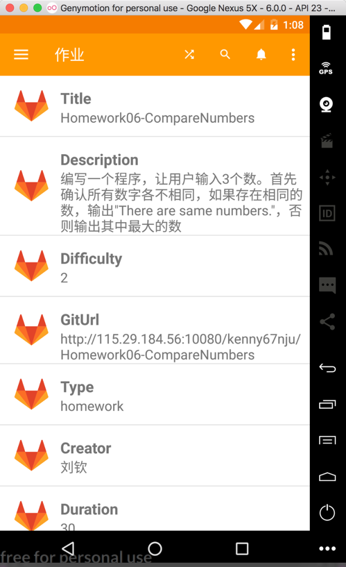
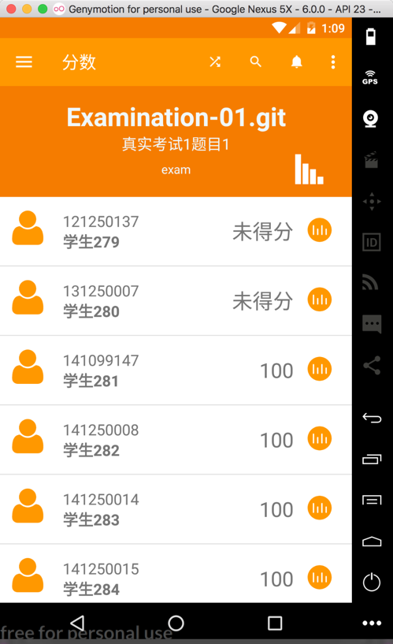
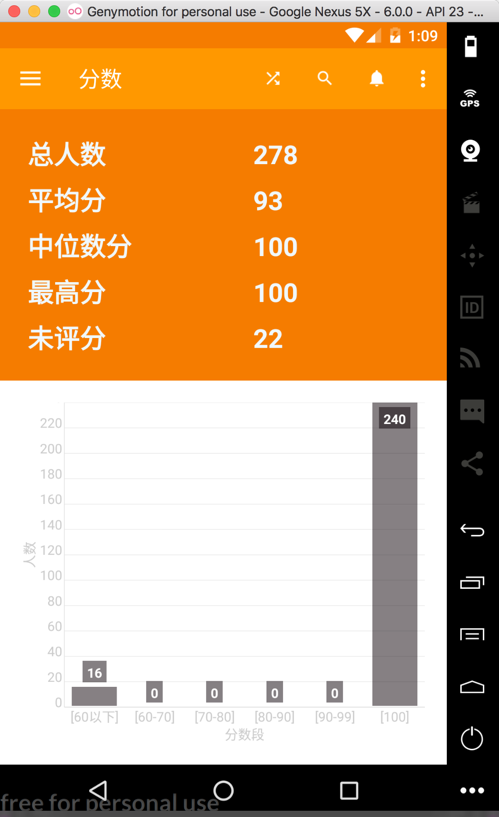
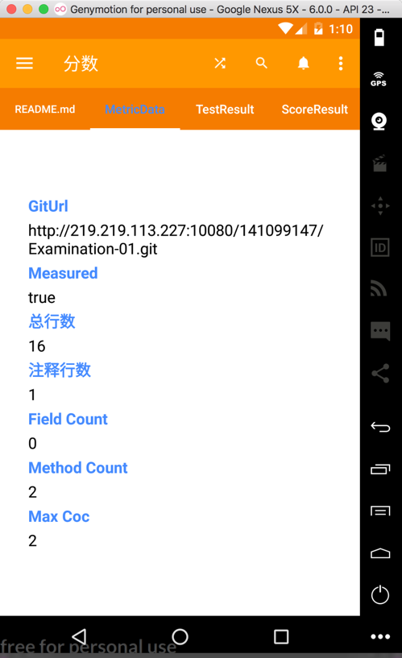
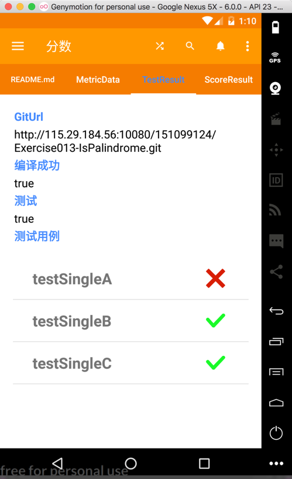
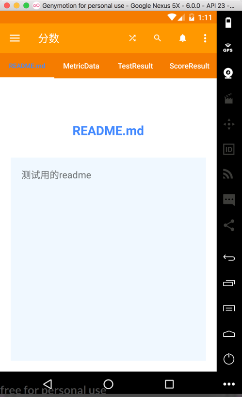

# GitLab_Androidapp
 - Homework of Android Development
 - Designer: Wjerry
 - Email: wjerry227@gmail.com

# 项目需求
软件学院刘老师为Java课程的学生部署了一个gitlab课程服务器。然后在服务器上老师账户下布置作业、练习和考试。每一项作业、练习和考试都是一个项目。项目包含Readme文件、Java源文件、测试用例。学生通过fork老师账户的项目到自己的账户下。然后git clone到本地进行开发。再commit 和push到gitlab的服务器中。服务器有程序自动评判学生的作业成绩。现在要求大家开发一个Gitlab课程客户端程序。能够方便学生查询课程服务器中的一些项目数据，包括成绩等统计数据。

## 老师用户
+ 登录系统
+ 查看学生列表
+ 查看自己账户的作业、练习和考试列表
+ 查看某次作业、练习和考试学生分数段
+ 查看某次作业、练习和考试学生考试分析(测试用例通过情况等)

## 学生用户
+ 登录系统
+ 查看老师账户的作业、练习和考试列表
+ 查看自己账户的作业、练习和考试列表的Reame文件
+ 查看自己作业、练习和考试统计信息(平均分，总评得分)
+ 查看某次作业、练习和考试学生考试分析(测试用例通过情况等)

# 项目截图
1. 登录界面

2. 查看学生列表

3. 作业、练习、考试

4. Assignment得分

5. 考试分析

6. 考试详情分析

